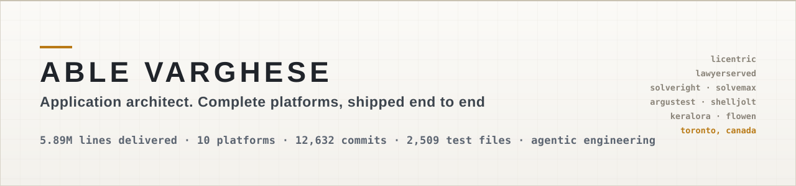
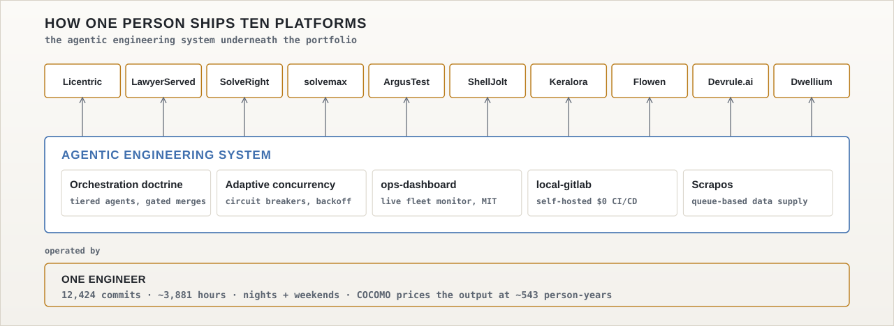
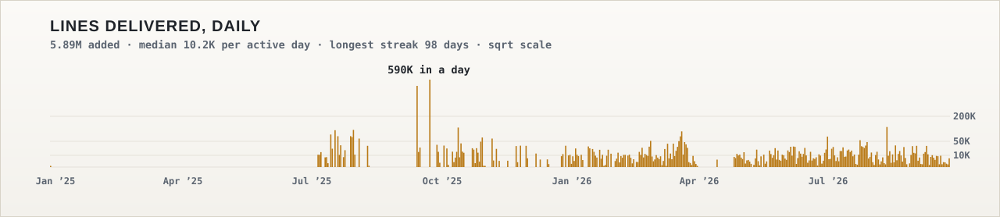
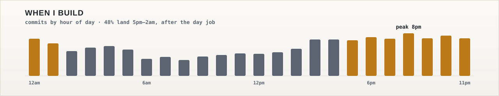
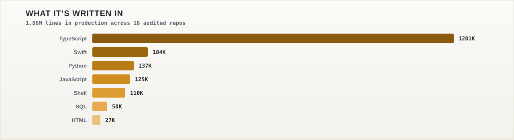

<picture>
  <source media="(prefers-color-scheme: dark)" srcset="assets/banner-dark.svg">
  
</picture>

### Application architect. I ship complete platforms, solo, at production grade.

*I like building complete production systems, and the engineering machines that build them.*

Software engineer since 2014. Banking-grade delivery at CIBC and payments fintechs. Since 2024:
**10+ products in under two years**, built end to end with **agentic AI engineering systems** of my
own design. Everything below is running software: full stacks, payment rails, compliance engines.

**Currently:** Application Systems Analyst at an Interac-member fintech (payments infrastructure) · Founder, building in Toronto 🇨🇦
**Open to** sharp conversations: architecture, agentic engineering, fintech.

---

## Platforms I've built and operate

| Platform | What it is | Under the hood |
|---|---|---|
| **[Licentric](https://licentric.com)** | Software licensing and monetization, from license keys to AI-agent tokens. 3 minutes to first validation vs. hours on incumbents | Ed25519 offline-first signed licenses · declarative Stripe→license mapping (zero webhook code) · Python SDK on PyPI · TypeScript |
| **[LawyerServed](https://lawyerserved.com)** | North America's transparent legal directory: **1.47M+ verified lawyer profiles** in a double-blind two-sided marketplace | Next.js 16 · tRPC · Drizzle · Supabase RLS · Meilisearch at 1M+ scale · Stripe · per-jurisdiction compliance rule-packs |
| **[SolveRight](https://solveright.ai)** | Decision intelligence. **155 decision frameworks** run simultaneously with deterministic 0–100 scoring and contradiction detection | Three-phase AI+deterministic hybrid scoring engine · <100ms sensitivity analysis · 7 export formats |
| **[solvemax](https://solvemax.solveright.ai)** | A verdict with receipts: decisions interrogated, scored, red-teamed through **5,000 seeded Monte-Carlo futures**, then given a blind second-pass audit | Next.js · multi-model LLM failover chain · Stripe · seeded deterministic simulation |
| **[ArgusTest](https://argustest.dev)** | iOS device monitoring and AI-assisted debugging for Claude Code / Cursor users. 100% app-agnostic | MCP integration · HMAC-verified webhooks · SHA-256 error dedup (78% noise reduction) · self-healing daemons |
| **[ShellJolt](https://shelljolt.com)** | macOS cockpit for AI coding CLIs. Cost, context, usage-limits, and model in one live line; stops OOM freezes before they happen | Rust · Ed25519 licensing · adaptive per-session memory engine · cross-CLI (Claude/Codex/Gemini/Grok) |
| **[Keralora](https://keralora.com)** | Invite-only B2B spice-trade platform, Kerala to Canada, with complete buyer↔seller anonymity | Three-wall anonymity architecture (DAL + Postgres RLS + document redaction) · anonymity test suite in CI |

## Engineering infrastructure I built to build them

<picture>
  <source media="(prefers-color-scheme: dark)" srcset="assets/system-dark.svg">
  
</picture>

The machine that builds the products:

- **Multi-agent orchestration doctrine**: model-tiered routing (reason/build/research), adaptive concurrency with circuit breakers, orchestrator-gated acceptance where no agent's work merges until independently re-verified
- **Scrapos**: standalone data-supply engine. 64 scrapers, queue-based pipeline, self-healing, drift-gated auto-redeploy
- **SwitchboardOS**: control plane for LLM cost, observability, and agent governance
- **[ops-dashboard](https://github.com/AbleVarghese/ops-dashboard)**: zero-dependency live SDLC monitor that watches every project's agents, tests, and git state simultaneously over SSE. **Open source (MIT)**
- **local-gitlab**: fully self-hosted GitLab CE + runner. $0/month CI/CD any project plugs into
- **Relay**: portable partner-marketing engine (attribution, commissions, payouts) that integrates with any product from zero code upward
- **[ios-claude-toolkit](https://github.com/AbleVarghese/ios-claude-toolkit)**: 22 battle-tested Claude Code skills for iOS, distilled from 75+ production sessions. **Open source (MIT)**
- **Flowen**: iOS money-transfer app. Swift 6, MVVM, **2,838 test methods**, 9-stage CI pipeline
- **Devrule.ai**: enterprise AI-rules middleware that validates code changes against configurable rules before AI tools (Claude Code, Cursor, Copilot) can execute them. Multi-tenant RLS, Stripe billing, 40+ test suites
- **Dwellium**: trust-first hotel booking platform. NestJS monorepo, **294-table** global schema, Amadeus + Stripe integration, web + React Native mobile

## The portfolio, measured

*Computed from git history across 20 repositories. Script and methodology published here
([`docs/METHODOLOGY.md`](docs/METHODOLOGY.md)): every number is checkable.*

**3.0M lines delivered** · **8,010 commits** · **1.27M lines in production** · **2,412 test files** · **2,115 docs
(554K lines)** · **254 active build days** · **~2,900 hours**, 49% of them between 5pm and 2am,
nights and weekends alongside a full-time payments-fintech role.

COCOMO-81 prices this codebase at **~364 person-years**. One person shipped it in ~2,900 hours.
**That multiplier is the point.**

*The public ledger only. 2014–2023 adds an estimated **5,000+ commits across 20+ enterprise
projects** (teams of 1 to 37), confidential by contract.*

<picture>
  <source media="(prefers-color-scheme: dark)" srcset="assets/daily-lines-dark.svg">
  
</picture>

*Lines attribute to commit dates: work often lands days after it happens, so active-day counts
are a floor and tall bars are batch landings. Aug '26 is a partial month. Every chart on this page
is generated from the audit data itself, no third-party widgets.*

<picture>
  <source media="(prefers-color-scheme: dark)" srcset="assets/hours-dark.svg">
  
</picture>

<picture>
  <source media="(prefers-color-scheme: dark)" srcset="assets/languages-dark.svg">
  
</picture>

## Recently shipped

<!-- shipped starts -->
- **[ops-dashboard](https://github.com/AbleVarghese/ops-dashboard)**: Ops dashboard (2026-08-09)
- **[AbleVarghese.github.io](https://github.com/AbleVarghese/AbleVarghese.github.io)**: Portfolio (2026-08-09)
- **[ios-claude-toolkit](https://github.com/AbleVarghese/ios-claude-toolkit)**: 22 battle-tested Claude Code skills for iOS/Swift development (2026-08-09)
- **[keralora.com](https://github.com/AbleVarghese/keralora.com)**: Invite-only B2B spice trade, Kerala → Canada, with three-wall… (2026-08-08)
- **[shelljolt.com](https://github.com/AbleVarghese/shelljolt.com)**: The cockpit for AI coding CLIs (2026-08-08)
- **[argustest.dev](https://github.com/AbleVarghese/argustest.dev)**: iOS device monitoring + AI-assisted debugging via MCP for Claude Code… (2026-08-08)

*Auto-generated 2026-08-08 by [update_readme.py](scripts/update_readme.py). Derived, never hand-edited.*
<!-- shipped ends -->

## Before this

**Interac-member fintech**, Application Systems Analyst: BASE24 / HP NonStop transaction processing, AI-agent orchestration for internal tooling
**CIBC** (4 yrs), Senior Application Engineer: architected and shipped five banking applications to production; Java/Python; CI/CD with IBM UrbanCode; Scrum Master; led the Drive Smart iOS/Android app team as PM; built an internal application platform and CMS used across Solutions, Development, QA, Build and Production teams
**StrongBase Capital**, securities and options trader: quantitative strategies, Greeks-based risk management
**Spine Hedge** (2021–), AI-powered fintech project: the bridge between my trading years and the platform portfolio above
**Earlier**: Mechanical Engineering @ Carleton · Software Engineering @ Centennial · NASA CanSat & Lunabotics team lead · conference speaker on engineering entrepreneurship

*Enterprise work before 2024 stays confidential, by contract and by principle. What those years
built is the discipline underneath everything above.*

## How I work

TDD-first · spec-before-code · structural fixes over patches · one source of truth · evidence
before conclusions. Codified as machine-enforced rules my agent fleets follow.
**Quality is a system property, not a habit.**

---

📫 **able.varghese@hotmail.com** · [LinkedIn](https://www.linkedin.com/in/ablevt/) · [X @AbleVeez](https://x.com/AbleVeez) · Toronto, Canada

<!-- profile v1.2 -->
